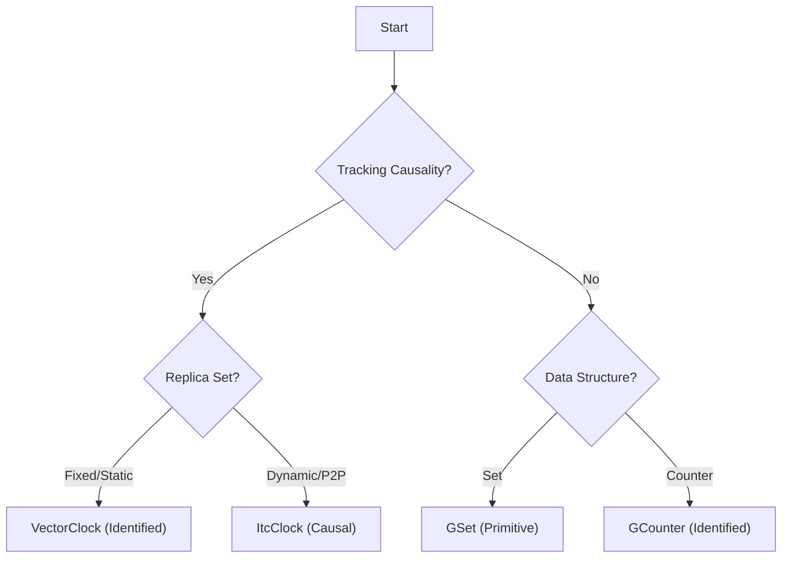

# CRDT Trait

[](https://github.com/bryanmehall/crdt-trait/actions/workflows/ci.yml)

A Rust library for creating creating robust distributed systems using custom Conflict-Free Replicated Datatypes.
This crate provides a well tested `CRDT` trait that lets you create custom, serializable CRDTs for your domain specific applications so that you can confidently create eventually consistent distributed systems.
It also includes off the shelf implementations of common CRDTs with examples that can be used directly or composed into larger CRDT data structures.
## Example
``` rust
#[derive(CRDT, Serialize, Deserialize)]
pub struct CustomCRDT {
    grow_only_field: 0
}

let node_1_state = CustomCRDT::init();
let node_2_state = node_1_state.fork();

node_1_state.update(|&mut old_state| old_state.grow_only_field += 1 );
```


## Eventual Consistency
Eventually consistent data structures allow the state of nodes within a distributed system to diverge when disconnected and then re-combine to an agreed upon state without central coordination.
More formally, eventually consistent data structure must obey the following properties:
### Idempotence
_An update applied multiple times will have the same effect as if it is only applied once_

For a state update $A$ and a merge operator $\sqcup$, $A \sqcup A = A$

### Commutativity
_The order of applying updates does not matter_

For state updates $A$ and $B$ and a merge operator $\sqcup$, $A \sqcup B = B \sqcup A$

### Associativity
_Updates from several nodes can be grouped arbitrarily_

For state updates $A$, $B$, and $C$, and a merge operator $\sqcup$, $(A \sqcup B) \sqcup C = A \sqcup (B \sqcup C)$


# Features
* **`serde`**: Make your CRDTs serializable
* **`proptest`**: Automatically generate tests to ensure your CRDTs will always converge to the same state

# Library Organization

This library classifies CRDTs into three categories based on how they handle identity and metadata:

1.  **Primitive (Anonymous)**: Pure state-based CRDTs that do not require replica identities.
    *   *Examples*: `GSet`
    *   *Usage*: `set.insert(val)`
2.  **Identified (Static Identity)**: CRDTs that manage metadata using a map of Replica IDs.
    *   *Examples*: `GCounter`, `VectorClock`.
    *   *Usage*: `counter.inc(&my_id)`
3.  **Causal (Dynamic Identity)**: Advanced CRDTs that track causality using dynamic, forkable identities (Interval Tree Clocks).
    *   **Examples**: `ItcClock`.
    *   **Usage**: `clock.apply((), itc_id)`

### Choosing a CRDT



# Comparison with Other Libraries

### vs. Automerge / Autosurgeon

*   **Automerge** is a "Document Store" engine. It records every change as an operation in a history graph, allowing for powerful features like time-travel and "magic" synchronization of JSON-like documents. However, this comes with memory and CPU overhead.
*   **This Library** is a "Toolkit". It allows you to compose strongly-typed, state-based CRDTs into native Rust structs. Updates are fast (native HashMap/Set operations), and state is compressed (no history log). You choose the specific CRDT semantics for each field.

### vs. rust-crdt

*   **[rust-crdt](https://github.com/rust-crdt/rust-crdt)** focuses on correctness through explicit context management. Users must manually manage `ReadCtx`, `AddCtx`, and `RmCtx` to perform updates, ensuring causal safety at the cost of verbosity.
*   **This Library** focuses on composition of CRDTs. It also supports **Interval Tree Clocks** for P2P systems with dynamic membership, which `rust-crdt` does not explicitly target.
