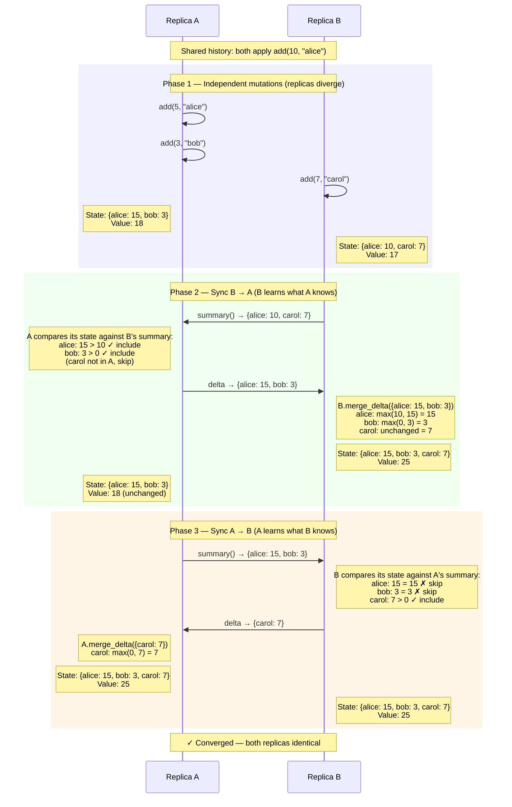
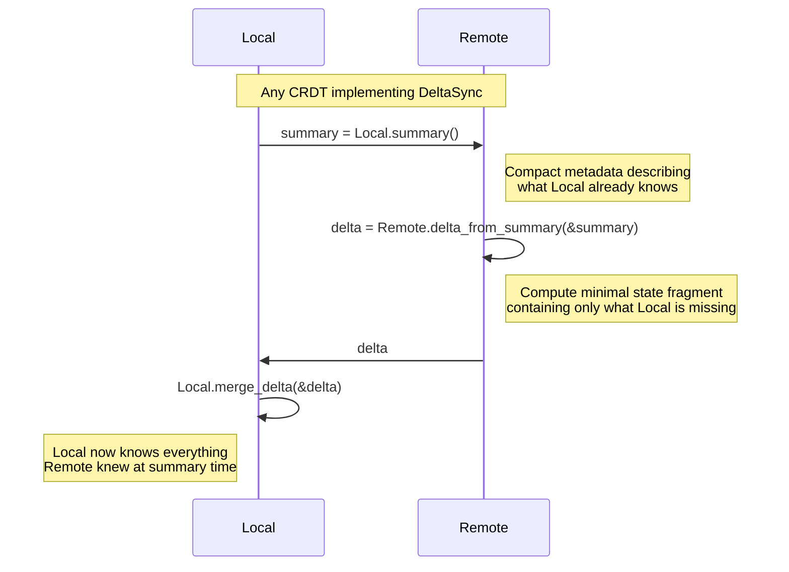

# Delta Sync Protocol — Sequence Diagram

This diagram traces the `delta_sync.rs` example step by step, showing the internal
state of each replica and what travels over the wire at each point.

## Scenario

Two GCounter replicas start with shared history, diverge independently, then
synchronize using the delta-state protocol.

---

## Sequence Diagram



## State Timeline

```
Time    Replica A                       Replica B
─────   ─────────────────────────       ─────────────────────────
t0      {alice: 10}          = 10       {alice: 10}          = 10
        ↓ add(5, alice)                 ↓ add(7, carol)
        ↓ add(3, bob)
t1      {alice: 15, bob: 3}  = 18       {alice: 10, carol: 7} = 17

                    ── sync B→A ──
                    summary:  {alice: 10, carol: 7}  ←── B sends
                    delta:    {alice: 15, bob: 3}    ──→ A sends

t2      {alice: 15, bob: 3}  = 18       {alice: 15, bob: 3,  = 25
        (unchanged)                       carol: 7}

                    ── sync A→B ──
                    summary:  {alice: 15, bob: 3}    ←── A sends
                    delta:    {carol: 7}             ──→ B sends

t3      {alice: 15, bob: 3,  = 25       {alice: 15, bob: 3,  = 25
          carol: 7}                        carol: 7}
                        ✓ converged
```

## What traveled over the wire

| Step | Direction | Payload | Size | vs Full State |
|------|-----------|---------|------|---------------|
| 1 | B → A | Summary: `{alice: 10, carol: 7}` | 2 entries | Same as full state for GCounter |
| 2 | A → B | Delta: `{alice: 15, bob: 3}` | 2 entries | Same — but only because A had 2 entries |
| 3 | A → B | Summary: `{alice: 15, bob: 3}` | 2 entries | 2 of 3 entries (B already knows carol) |
| 4 | B → A | Delta: `{carol: 7}` | **1 entry** | **vs 3 entries in full state** |

The savings grow with state size. For a GCounter with 1000 replicas where only 1
has changed, the delta is 1 entry instead of 1000.

## Generic Protocol



## Key Invariant

For any two states A and B:

```
A ⊔ δ(B, σ(A)) = A ⊔ B
```

Delta sync produces the **same result** as full-state merge — it's just more efficient
on the wire because the delta `δ(B, σ(A))` is typically much smaller than `B`.
